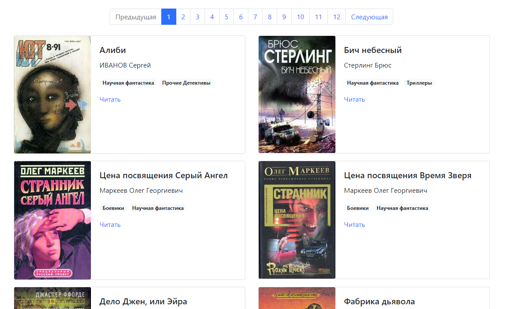

# Моя библиотека

Сайт с книгами собранными с сайта [tululu.org](https://tululu.org/)

[Здесь](https://nstonic.github.io/books/pages/index1.html) можно посмотреть опубликованную версию.



## Как установить

- Для запуска сайта вам понадобится Python3.
- Установите зависимости командой:

```sh
pip install -r requirements.txt
```

- В файле *settings.py* укажите путь к json-файлу с данными по книгам в переменной JSON_PATH:

```sh
JSON_PATH = 'books.json'
```

## Как запустить

- Скрипт запускается командой:

```
python render_website.py [--json_path JSON_PATH]
``` 

Необязательный аргумент `--json_path` позволяет задать альтернативный путь к json-файлу с данными по книгам.
Если он задан, то значение из переменной JSON_PATH из файла *settings.py* будет проигнорировано.

- После запуска перейдите в браузере по адресу [127.0.0.1:5500](http://127.0.0.1:5500/)

## Как открыть офлайн версию библиотеки

Страницы сайта можно открыть в офф-лайн режиме. Для этого скачайте следующие папки:

- pages/
- media/
- static/

Скачивайте папки целиком и сохраняйте их рядом друг с другом в одной папке у себя на компьютере.
Затем откройте любую страницу, лежащую в папке *pages/*. Они называются соответственно *index1.html*,
*index2.html* и т.д.

## Цель проекта

Код написан в образовательных целях на онлайн-курсе для веб-разработчиков [dvmn.org](https://dvmn.org/).
